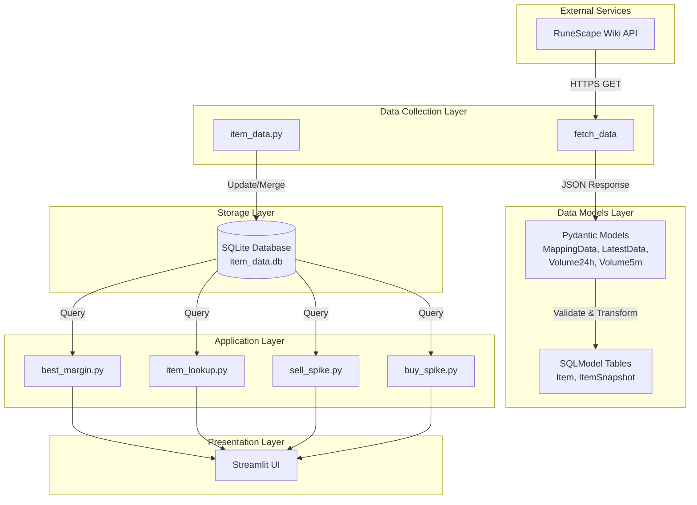
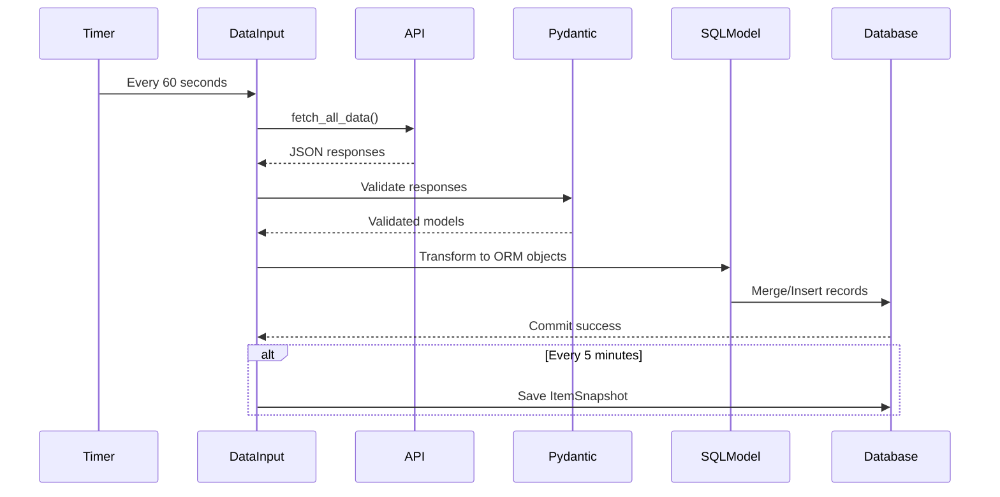
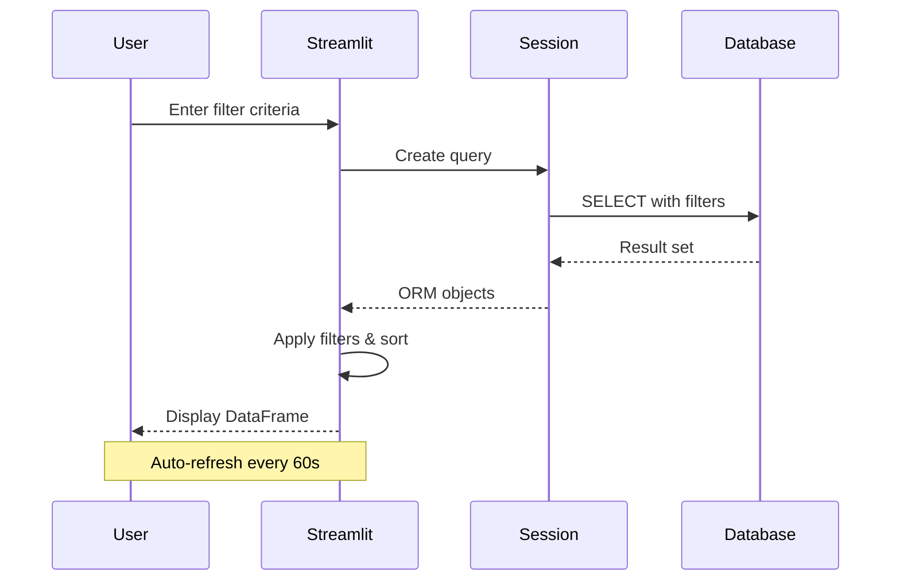

# System Architecture

## Overview
The OSRS GE Tracker follows a layered architecture with clear separation between data collection, storage, and presentation layers. The system is designed for continuous data ingestion with periodic storage of time-series data.

## Architecture Diagram

## Architectural Layers

### 1. Data Collection Layer
**Purpose:** Fetch and validate external API data
**Components:**
- `backend.db.item_data` - Main data ingestion orchestrator
- API wrapper functions for each endpoint
- Request handling with custom headers

**Design Patterns:**
- Wrapper pattern for API endpoints
- Scheduled polling (60-second intervals)
- Periodic snapshot storage (5-minute intervals for volume data)

### 2. Data Models Layer
**Purpose:** Define data structures and enforce validation
**Components:**
- **Pydantic Models** - API response validation and parsing
- **SQLModel Tables** - Database schema and ORM mapping

**Design Patterns:**
- Data Transfer Objects (DTOs) via Pydantic
- Active Record pattern via SQLModel
- Property decorators for computed fields

### 3. Storage Layer
**Purpose:** Persist and retrieve market data
**Components:**
- SQLite database with two main tables:
  - `item` - Current item prices and metadata
  - `itemsnapshot` - Historical 5-minute volume snapshots

**Design Patterns:**
- Single database pattern
- Merge strategy for updates (upsert)
- Time-series data storage for snapshots

### 4. Application Layer
**Purpose:** Business logic and data analysis
**Components:**
- Margin calculation utilities
- Item filtering logic
- Volume analysis (in development)

**Design Patterns:**
- Utility functions for calculations
- Query-based filtering
- Operator-based comparison logic

### 5. Presentation Layer
**Purpose:** User interface and visualization
**Components:**
- Streamlit web applications
- Auto-refresh mechanism
- Interactive filters and search

**Design Patterns:**
- Component-based UI (Streamlit)
- Real-time data binding
- Session state management

## Data Flow

### Primary Data Ingestion Flow

### User Query Flow

## Key Design Principles

### 1. Separation of Concerns
- Clear boundaries between data fetching, storage, and presentation
- Pydantic for API validation, SQLModel for database operations
- Separate modules for utilities and business logic

### 2. Continuous Data Collection
- Infinite loop with sleep intervals for real-time tracking
- Scheduled snapshots for time-series analysis
- Non-blocking design allows concurrent Streamlit apps

### 3. Data Validation
- API responses validated through Pydantic models
- Type hints throughout codebase
- Optional field handling with defaults

### 4. Extensibility
- New Streamlit apps easily added to `usage/` directory
- Modular utility functions in `backend/util/`
- Flexible filtering with operator-based comparisons

## Scalability Considerations

### Current Design
- Single SQLite database (suitable for local/single-user use)
- In-memory filtering of query results
- Synchronous API calls

### Potential Improvements
- Database: Could migrate to PostgreSQL for multi-user support
- Caching: Add Redis for frequently accessed data
- API: Implement async/await for concurrent API calls
- Queue: Use Celery for background task management
- Time-series: Consider TimescaleDB for snapshot data

## Security Considerations
- User-Agent header identifies the application
- API keys not required (public API)
- No authentication/authorization (local application)
- Database file permissions rely on OS-level security
