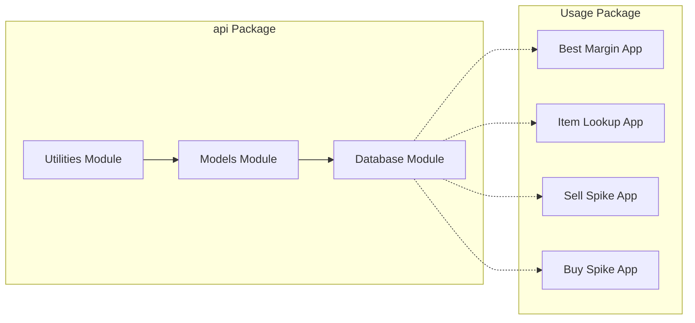
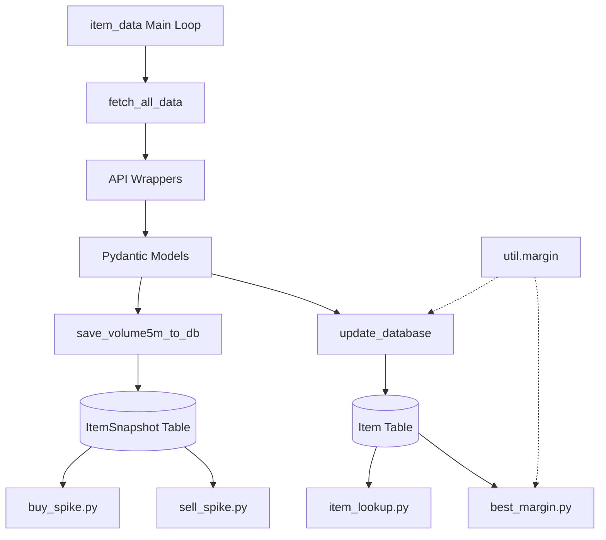
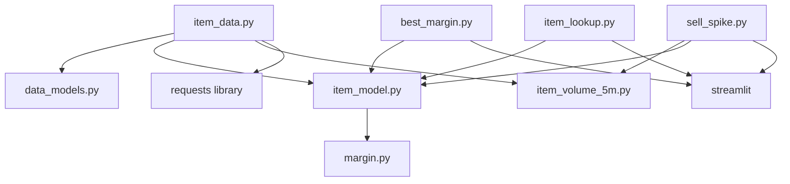

# Components

## Component Overview



## Core Components

### 1. api.db.item_data
**Purpose:** Central data ingestion and database update orchestrator

**Responsibilities:**
- Fetch data from RuneScape Wiki API endpoints
- Validate API responses using Pydantic models
- Transform validated data to SQLModel objects
- Update database with latest item information
- Store periodic volume snapshots

**Key Functions:**
- `fetch_data(api_url)` - Generic API request handler
- `mapping_wrapper()` - Fetch item metadata
- `latest_wrapper()` - Fetch current prices
- `volume_wrapper()` - Fetch 24-hour volumes
- `volume5m_wrapper()` - Fetch 5-minute volume data
- `fetch_all_data()` - Orchestrate all API calls
- `update_database()` - Merge latest data into Item table
- `save_volume5m_to_db()` - Store time-series snapshots

**Configuration:**
```python
LATEST_API_URL = "https://prices.runescape.wiki/api/v1/osrs/latest"
MAPPING_API_URL = "https://prices.runescape.wiki/api/v1/osrs/mapping"
VOLUME_API_URL = "https://prices.runescape.wiki/api/v1/osrs/volumes"
VOLUME_5M_API_URL = "https://prices.runescape.wiki/api/v1/osrs/5m"
DB_FILE = "sqlite:///item_data.db"
```

**Main Loop:**
- Runs indefinitely when executed directly
- 60-second refresh interval for price updates
- Every 5th iteration saves volume snapshot
- Continuous console output for monitoring

**Dependencies:**
- requests (HTTP client)
- sqlmodel (ORM)
- Pydantic models from data_models
- SQLModel tables from item_model and item_volume_5m

---

### 2. api.models
**Purpose:** Define data structures for API responses and database tables

#### 2.1 data_models.py (Pydantic Models)
**API Response Models:**

**MappingData** - Individual item metadata
- Fields: id, name, examine, members, lowalch, highalch, limit, value, icon
- Source: `/osrs/mapping` endpoint

**MappingList** - Collection of item metadata
- Contains: List[MappingData]

**ItemData** - Current price information
- Fields: high, highTime, low, lowTime (all optional)
- Source: `/osrs/latest` endpoint

**LatestData** - Complete price data
- Contains: Dict[int, ItemData] keyed by item ID

**Volume24h** - 24-hour trading volume
- Fields: timestamp, data (Dict[str, int])
- Source: `/osrs/volumes` endpoint

**Volume5mItem** - 5-minute interval volume data
- Fields: avgHighPrice, highPriceVolume, avgLowPrice, lowPriceVolume
- All fields optional with defaults

**Volume5m** - Collection of 5-minute data
- Contains: Dict[str, Volume5mItem] keyed by item ID string
- Properties: avg_high_price, avg_high_volume, avg_low_price, avg_low_volume
- Computed properties calculate averages across all items

#### 2.2 item_model.py (SQLModel Table)
**Item** - Main item table

**Fields:**
- `id` (int, primary key) - Item ID
- `name` (str) - Item name
- `examine` (str) - Examine text
- `members` (bool) - Members-only item
- `lowalch` (int) - Low alchemy value
- `limit` (int) - GE buy limit
- `value` (int) - Item value
- `highalch` (int) - High alchemy value
- `icon` (str) - Icon URL
- `high` (int, nullable) - Instant-sell price
- `highTime` (int, nullable) - Last update timestamp for high price
- `low` (int, nullable) - Instant-buy price
- `lowTime` (int, nullable) - Last update timestamp for low price
- `volume_24h` (int) - 24-hour trading volume

**Properties:**
- `margin` - Computed profit after GE tax

**Helper Functions:**
- `safe_int(val)` - Safely convert values to integers

#### 2.3 item_volume_5m.py (SQLModel Table)
**ItemSnapshot** - Time-series volume data

**Fields:**
- `id` (int, primary key) - Auto-incrementing ID
- `item_id` (int, indexed) - Reference to Item
- `timestamp` (datetime, indexed) - Snapshot time
- `avg_high_price` (float, nullable) - Average sell price
- `high_price_volume` (int, nullable) - Sell volume
- `avg_low_price` (float, nullable) - Average buy price
- `low_price_volume` (int, nullable) - Buy volume
- `total_volume` (int, nullable) - Sum of buy and sell volumes

**Table Name:** itemsnapshot

**Purpose:** Track price and volume changes over time for spike detection

---

### 3. api.util.margin
**Purpose:** Calculate Grand Exchange profit margins with tax

**Function:** `ge_margin(high_price, low_price) -> int`

**Logic:**
```python
tax = min(high_price // 100, 5_000_000)  # 1% tax, max 5M
profit = (high_price - tax) - low_price
```

**Context:**
- OSRS GE charges 1% tax on sell price
- Tax capped at 5,000,000 coins
- Critical for accurate profit calculations

---

### 4. usage.best_margin
**Purpose:** Interactive dashboard for finding profitable trading opportunities

**Features:**
- Real-time filtering with multiple criteria
- Auto-refresh every 60 seconds
- Flexible comparison operators (>, <)
- Number parsing (supports k, m, b, t suffixes)

**Filter Criteria:**
- Low price (instant-buy price)
- High price (instant-sell price)
- Margin (profit per item)
- 24-hour volume

**Display:**
- Sortable DataFrame with Name, Low, High, Margin, Volume
- Default sort by Margin (descending)
- Warning message if no matches found

**Helper Function:**
- `parse_num(val)` - Parse human-readable numbers (e.g., "100k" → 100000)
- `compare(val, op, ref)` - Generic comparison operator

**UI Components:**
- Selectbox for operators
- Text input for values
- Auto-refreshing dataframe display

---

### 5. usage.item_lookup
**Purpose:** Search and view individual item details

**Features:**
- Fuzzy search by item name
- Case-insensitive substring matching
- Dropdown selection from filtered results
- Complete item detail display

**Current Issue:**
- References `item_name` property that doesn't exist on Item model
- Should use `name` instead

**UI Flow:**
1. User enters search text
2. Filter item names by substring match
3. Select from dropdown
4. Display full item object

---

### 6. usage.sell_spike & buy_spike
**Purpose:** Detect price/volume spikes for trading opportunities

**Status:** In development
- `buy_spike.py` - Only contains comment: "# high price = insta buy"
- `sell_spike.py` - Partial implementation with database queries

**sell_spike.py Current State:**
- Queries ItemSnapshot table
- Queries latest data (incorrect query)
- Basic Streamlit title
- No spike detection logic yet

**Intended Purpose:**
- Analyze ItemSnapshot time-series data
- Detect abnormal volume or price changes
- Alert users to profitable spike opportunities

---

## Component Relationships

### Data Flow Between Components


### Dependency Graph


## Testing Structure
Based on compiled test artifacts in `tests/` directory:
- `tests/api/db/test_item_data` - Data ingestion tests
- `tests/api/models/test_data_models` - Pydantic model tests
- `tests/api/models/test_item_model` - Item table tests
- `tests/api/models/test_item_volume_5m` - Snapshot table tests
- `tests/api/util/test_averages` - Average calculation tests
- `tests/api/util/test_margin` - Margin calculation tests
- `tests/usage/test_best_margin` - Best margin app tests
- `tests/usage/test_item_lookup` - Item lookup app tests

**Note:** Test source files are not in repository (only .pyc bytecode exists)
