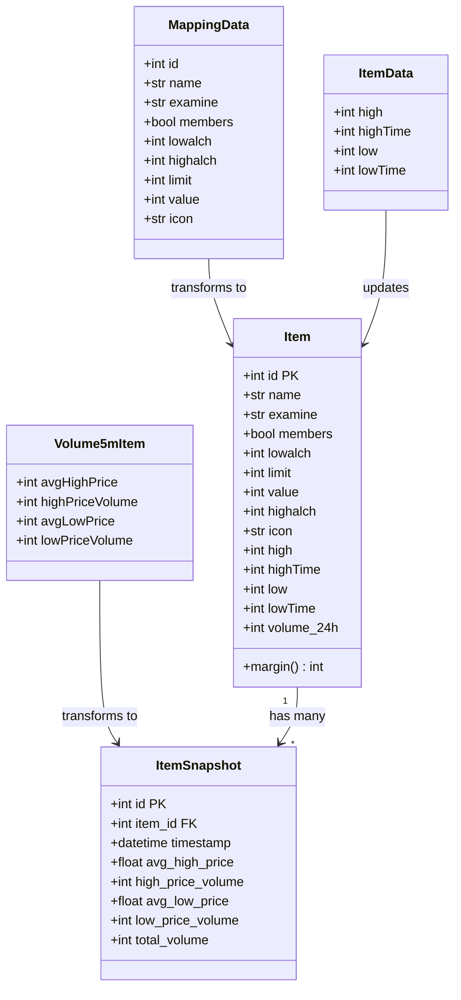
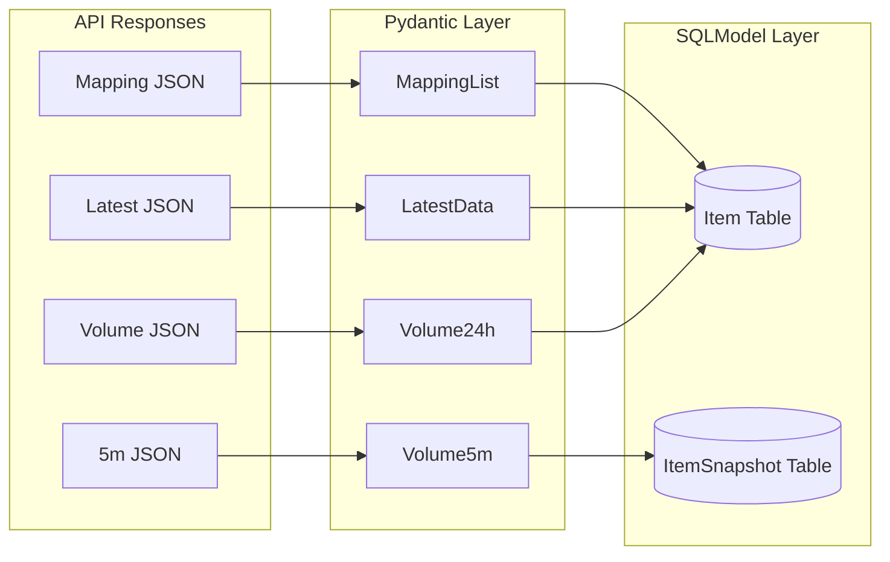
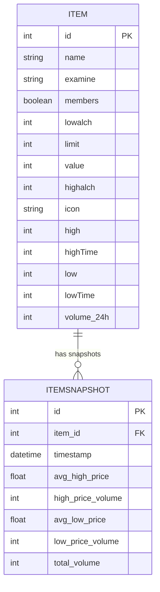

# Data Models

## Model Overview

The codebase uses two types of models:
1. **Pydantic Models** - For API response validation and data transfer
2. **SQLModel Tables** - For database persistence and ORM



## Pydantic Models (Data Transfer Objects)

### MappingData
**Purpose:** Represents item metadata from the mapping API

**Module:** `aggregator.models.data_models`

**Fields:**
```python
class MappingData(BaseModel):
    examine: str                    # Item examine text
    id: int                        # Unique item ID
    members: bool                  # True if members-only
    lowalch: Optional[int] = 0     # Low alchemy value
    highalch: Optional[int] = 0    # High alchemy value
    limit: Optional[int] = 0       # GE buy limit per 4 hours
    value: int = 0                 # Base item value
    icon: Optional[str] = ""       # Icon image URL
    name: str                      # Item display name
```

**Usage:**
```python
mapping_data = MappingData(**api_response)
```

**Notes:**
- Validates data from `/osrs/mapping` endpoint
- Most fields have sensible defaults for missing data
- Used to populate Item table metadata

---

### MappingList
**Purpose:** Container for multiple MappingData objects

**Module:** `aggregator.models.data_models`

**Fields:**
```python
class MappingList(BaseModel):
    items: List[MappingData]
```

**Usage:**
```python
data = fetch_data(MAPPING_API_URL)
mapping_list = MappingList(items=[MappingData(**item) for item in data])
```

---

### ItemData
**Purpose:** Represents current price data for a single item

**Module:** `aggregator.models.data_models`

**Fields:**
```python
class ItemData(BaseModel):
    high: Optional[int] = None      # Instant-sell price
    highTime: Optional[int] = None  # Unix timestamp of last high update
    low: Optional[int] = None       # Instant-buy price
    lowTime: Optional[int] = None   # Unix timestamp of last low update
```

**Usage:**
```python
item_data = ItemData(**api_response["data"]["2"])
```

**Notes:**
- All fields optional as some items may not have active trading
- Timestamps in Unix epoch format
- Used to update Item table prices

---

### LatestData
**Purpose:** Container for all items' current prices

**Module:** `aggregator.models.data_models`

**Fields:**
```python
class LatestData(BaseModel):
    data: Dict[int, ItemData]  # Maps item ID to price data
```

**Usage:**
```python
latest = LatestData(**api_response)
for item_id, prices in latest.data.items():
    print(f"Item {item_id}: buy at {prices.low}, sell at {prices.high}")
```

---

### Volume24h
**Purpose:** Container for 24-hour trading volumes

**Module:** `aggregator.models.data_models`

**Fields:**
```python
class Volume24h(BaseModel):
    timestamp: Optional[int] = 0        # Unix timestamp
    data: Dict[str, Optional[int]]      # Maps item ID (string) to volume
```

**Usage:**
```python
volumes = Volume24h(**api_response)
volume = volumes.data.get(str(item_id), 0)
```

**Notes:**
- Keys in data dict are strings, not ints
- Volume represents total traded quantity in 24 hours
- None values default to 0

---

### Volume5mItem
**Purpose:** Represents 5-minute interval volume and price data

**Module:** `aggregator.models.data_models`

**Fields:**
```python
class Volume5mItem(BaseModel):
    avgHighPrice: Optional[int] = None      # Avg instant-sell price
    highPriceVolume: Optional[int] = 0      # Items sold in interval
    avgLowPrice: Optional[int] = None       # Avg instant-buy price
    lowPriceVolume: Optional[int] = 0       # Items bought in interval
```

**Usage:**
```python
item_5m = Volume5mItem(**api_response["data"]["2"])
```

---

### Volume5m
**Purpose:** Container for all items' 5-minute data with computed properties

**Module:** `aggregator.models.data_models`

**Fields:**
```python
class Volume5m(BaseModel):
    data: Dict[str, Volume5mItem]  # Maps item ID (string) to 5m data
```

**Computed Properties:**
```python
@property
def avg_high_price(self) -> Optional[float]:
    """Average of all items' avgHighPrice"""
    values = [item.avgHighPrice for item in self.data.values()
              if item.avgHighPrice is not None]
    return sum(values) / len(values) if values else None

@property
def avg_high_volume(self) -> Optional[float]:
    """Average of all items' highPriceVolume"""
    ...

@property
def avg_low_price(self) -> Optional[float]:
    """Average of all items' avgLowPrice"""
    ...

@property
def avg_low_volume(self) -> Optional[float]:
    """Average of all items' lowPriceVolume"""
    ...
```

**Usage:**
```python
volume_5m = Volume5m.model_validate(api_response)
overall_avg_price = volume_5m.avg_high_price
item_data = volume_5m.data[str(item_id)]
```

---

## SQLModel Tables (Database Schema)

### Item
**Purpose:** Main table storing current item information and prices

**Module:** `aggregator.models.item_model`

**Table Name:** `item` (auto-generated)

**Schema:**
```python
class Item(SQLModel, table=True):
    # Primary Key
    id: int | None = Field(default=None, primary_key=True)

    # Item Metadata
    name: str = Field(default="Unknown")
    examine: str = Field(default="")
    members: bool = Field(default=False)
    icon: str = Field(default="")

    # Game Values
    lowalch: int = Field(default=0)     # Low alchemy GP
    highalch: int = Field(default=0)    # High alchemy GP
    value: int = Field(default=0)       # Base value
    limit: int = Field(default=0)       # GE buy limit

    # Current Prices
    high: int | None = Field(default=None)      # Instant-sell
    highTime: int | None = Field(default=None)  # Last high update
    low: int | None = Field(default=None)       # Instant-buy
    lowTime: int | None = Field(default=None)   # Last low update

    # Trading Volume
    volume_24h: int = Field(default=0)
```

**Computed Property:**
```python
@property
def margin(self) -> int:
    """Calculate profit per item after GE tax"""
    return ge_margin(self.high, self.low)
```

**Helper Function:**
```python
def safe_int(val):
    """Return val if it's a valid int, else 0"""
    return val if isinstance(val, int) and val is not None else 0
```

**Usage:**
```python
# Create/update item
item = Item(
    id=2,
    name="Cannonball",
    low=184,
    high=185,
    volume_24h=1000000
)
session.merge(item)  # Upsert
session.commit()

# Query
item = session.get(Item, 2)
print(f"Margin: {item.margin} coins")
```

**Database Operations:**
- **Merge Strategy:** Uses `session.merge()` for upsert behavior
- **Unique Constraint:** Primary key on `id`
- **Indexes:** None explicitly defined (only PK)

---

### ItemSnapshot
**Purpose:** Time-series table for historical 5-minute volume data

**Module:** `aggregator.models.item_volume_5m`

**Table Name:** `itemsnapshot` (explicitly set)

**Schema:**
```python
class ItemSnapshot(SQLModel, table=True):
    __tablename__ = "itemsnapshot"

    # Primary Key
    id: int | None = Field(default=None, primary_key=True)

    # Foreign Key (no explicit constraint)
    item_id: int = Field(index=True)

    # Timestamp
    timestamp: datetime = Field(index=True)

    # Price Data
    avg_high_price: float | None = None      # Avg sell price
    avg_low_price: float | None = None       # Avg buy price

    # Volume Data
    high_price_volume: int | None = None     # Sell volume
    low_price_volume: int | None = None      # Buy volume
    total_volume: int | None = None          # Sum of both
```

**Indexes:**
- `item_id` - For efficient item lookup
- `timestamp` - For time-range queries

**Usage:**
```python
# Create snapshot
snapshot = ItemSnapshot(
    item_id=2,
    timestamp=datetime.now(timezone.utc),
    avg_high_price=185.5,
    high_price_volume=52341,
    avg_low_price=184.2,
    low_price_volume=48921,
    total_volume=101262
)
session.add(snapshot)
session.commit()

# Query recent snapshots
recent = session.exec(
    select(ItemSnapshot)
    .where(ItemSnapshot.item_id == 2)
    .where(ItemSnapshot.timestamp > cutoff_time)
    .order_by(ItemSnapshot.timestamp.desc())
).all()
```

**Intended Use Cases:**
- Detect price spikes over time
- Analyze volume trends
- Identify abnormal trading patterns
- Historical price analysis

---

## Data Transformation Flow

### API Response → Database



### Transformation Logic

**MappingData + ItemData + Volume → Item:**
```python
mapping_info = mapping_dict.get(item_id)
prices = latest_data.data.get(item_id)
volume = volume_dict.get(str(item_id), 0)

item = Item(
    # From MappingData
    id=item_id,
    name=mapping_info.name,
    examine=mapping_info.examine,
    members=mapping_info.members,
    lowalch=mapping_info.lowalch,
    limit=mapping_info.limit,
    value=mapping_info.value,
    highalch=mapping_info.highalch,
    icon=mapping_info.icon,
    # From ItemData
    high=prices.high,
    highTime=prices.highTime,
    low=prices.low,
    lowTime=prices.lowTime,
    # From Volume24h
    volume_24h=volume
)
```

**Volume5mItem → ItemSnapshot:**
```python
for item_id, item_data in volume_5m_data.data.items():
    high_vol = item_data.highPriceVolume or 0
    low_vol = item_data.lowPriceVolume or 0
    total_vol = high_vol + low_vol

    snapshot = ItemSnapshot(
        item_id=int(item_id),
        timestamp=datetime.now(timezone.utc),
        avg_high_price=item_data.avgHighPrice,
        high_price_volume=high_vol,
        avg_low_price=item_data.avgLowPrice,
        low_price_volume=low_vol,
        total_volume=total_vol
    )
```

---

## Data Validation

### Type Safety
- All models use Python type hints
- Pydantic enforces types at runtime
- SQLModel validates database operations

### Optional Fields
- API responses may omit fields
- Optional fields have sensible defaults
- Null handling with `| None` syntax

### Data Constraints
- No explicit validation rules (min/max, regex, etc.)
- Relies on API data quality
- Database constraints limited to primary keys and indexes

**Potential Improvements:**
- Add Pydantic validators for price ranges
- Enforce foreign key constraints in SQLModel
- Add check constraints for logical invariants (e.g., high >= low)

---

## Database Schema Diagram



**Relationship:** One-to-Many (Item → ItemSnapshot)
- One item has many snapshots over time
- No explicit foreign key constraint in schema
- Relationship maintained logically via `item_id`
