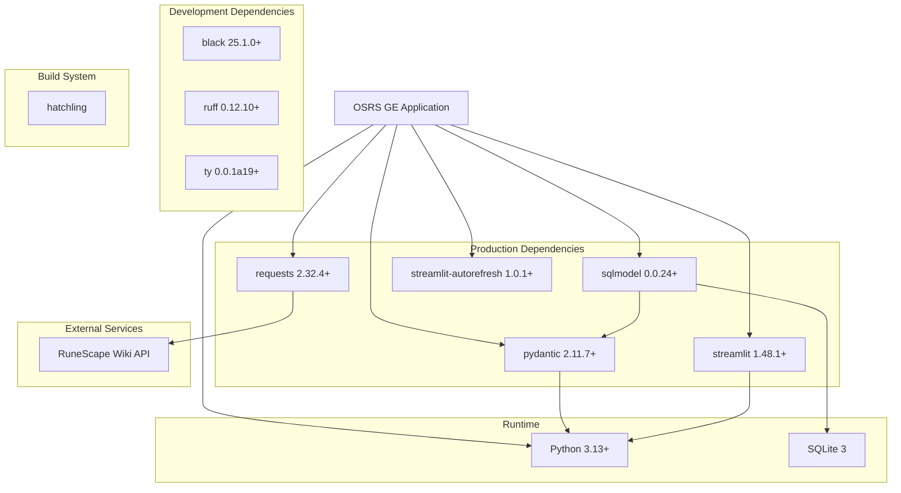

# Dependencies

## Overview

The project uses a modern Python stack with minimal external dependencies, focusing on data validation, web interfaces, and database operations.

## Dependency Graph



## Production Dependencies

### pydantic (>=2.11.7)
**Purpose:** Data validation and settings management

**Usage in Project:**
- Validate API responses from RuneScape Wiki
- Define data schemas for:
  - `MappingData` - Item metadata
  - `LatestData` - Current prices
  - `Volume24h` - 24-hour volumes
  - `Volume5m` - 5-minute interval data
- Type coercion and validation
- Computed properties on models

**Key Features Used:**
- `BaseModel` for data classes
- `Optional` field handling with defaults
- `model_validate()` for strict validation
- Property decorators for computed fields

**Example:**
```python
class ItemData(BaseModel):
    high: Optional[int] = None
    low: Optional[int] = None
```

**Why This Version:** Requires Pydantic v2 for modern features and performance

---

### requests (>=2.32.4)
**Purpose:** HTTP client for API interactions

**Usage in Project:**
- Fetch data from RuneScape Wiki API
- Custom headers for API identification
- JSON response parsing

**API Endpoints:**
- `/osrs/mapping` - Item metadata
- `/osrs/latest` - Current prices
- `/osrs/volumes` - 24-hour volumes
- `/osrs/5m` - 5-minute intervals

**Example:**
```python
response = requests.get(api_url, headers=HEADERS)
if response.status_code == 200:
    return response.json()
```

**Why This Version:** Security and bug fixes in 2.32.x series

---

### sqlmodel (>=0.0.24)
**Purpose:** SQL database ORM with Pydantic integration

**Usage in Project:**
- Define database tables:
  - `Item` - Main item table
  - `ItemSnapshot` - Time-series data
- Database operations:
  - Create/update with `session.merge()`
  - Query with `session.exec(select())`
  - Relationship management

**Key Features Used:**
- `SQLModel` base class (combines SQLAlchemy + Pydantic)
- `Field()` for column configuration
- Primary keys and indexes
- Property decorators for computed fields
- Session management

**Example:**
```python
class Item(SQLModel, table=True):
    id: int | None = Field(default=None, primary_key=True)
    name: str = Field(default="Unknown")

    @property
    def margin(self) -> int:
        return ge_margin(self.high, self.low)
```

**Why This Version:** Latest stable release with bug fixes

**Underlying Dependencies:**
- SQLAlchemy (ORM engine)
- Pydantic (validation)

---

### streamlit (>=1.48.1)
**Purpose:** Web application framework for data apps

**Usage in Project:**
- Build interactive dashboards:
  - `best_margin.py` - Profit finder
  - `item_lookup.py` - Item search
  - `sell_spike.py` / `buy_spike.py` - Spike detection
- UI components:
  - Text inputs
  - Selectboxes
  - DataFrames
  - Warnings/messages
- Session state management

**Key Features Used:**
- `st.title()` - Page titles
- `st.text_input()` - Text entry
- `st.selectbox()` - Dropdowns
- `st.dataframe()` - Table display
- `st.write()` - Generic output
- `st.warning()` - Alert messages

**Example:**
```python
st.title("OSRS Margin lookup")
margin_val = st.text_input("Margin value", value="100k")
st.dataframe(df)
```

**Why This Version:** Latest stable with performance improvements

---

### streamlit-autorefresh (>=1.0.1)
**Purpose:** Automatic page refresh for real-time data

**Usage in Project:**
- Auto-refresh `best_margin.py` every 60 seconds
- Keep data synchronized with database updates
- Non-blocking refresh mechanism

**Example:**
```python
REFRESH_INTERVAL = 60
st_autorefresh(interval=REFRESH_INTERVAL * 1000, key="db_refresh")
```

**Why This Version:** Stable release with Streamlit compatibility

---

## Development Dependencies

### black (>=25.1.0)
**Purpose:** Opinionated Python code formatter

**Usage in Project:**
- Enforce consistent code style
- Automatic formatting on save
- Integrated via Nix development environment

**Configuration:** Uses defaults (88 character line length)

**Invocation:**
```bash
black api/ usage/
```

---

### ruff (>=0.12.10)
**Purpose:** Fast Python linter (replaces flake8, isort, etc.)

**Usage in Project:**
- Code quality checks
- Import sorting
- Style enforcement
- Error detection

**Configuration in `pyproject.toml`:**
```toml
[tool.ruff]
line-length = 88
lint.select = ["ALL"]  # Enable all rules
lint.ignore = [
    "A001", "A003", "A005",  # Shadowing builtins
    "D200", "D203", "D212",  # Docstring formatting
    "E501",                   # Line too long (handled by black)
    "S101",                   # Use of assert
    # ... many more exceptions
]
```

**Invocation:**
```bash
ruff check api/ usage/
ruff format api/ usage/
```

---

### ty (>=0.0.1a19)
**Purpose:** Type checker for Python

**Usage in Project:**
- Static type analysis
- Catch type errors before runtime
- Enforce type hint consistency

**Configuration in `pyproject.toml`:**
```toml
[tool.ty.environment]
extra-paths = [".direnv/site"]
```

**Invocation:**
```bash
ty check api/ usage/
```

---

## Build System

### hatchling
**Purpose:** Modern Python build api

**Usage in Project:**
- Package building
- Distribution management
- Dependency resolution

**Configuration in `pyproject.toml`:**
```toml
[build-system]
requires = ["hatchling"]
build-api = "hatchling.build"

[tool.hatch.build.targets.sdist]
include = ["api"]

[tool.hatch.build.targets.wheel]
include = ["api"]
```

---

## Runtime Environment

### Python 3.13+
**Minimum Version:** 3.13
**Required Features:**
- Modern type hints (`int | None` syntax)
- Pattern matching (not used yet)
- Performance improvements

**Version Specified In:**
- `pyproject.toml`: `requires-python = ">=3.13"`
- `default.nix`: `python = pkgs.python313`

---

### SQLite 3
**Purpose:** Embedded SQL database

**Usage:**
- Store item data
- Store time-series snapshots
- No configuration required

**Database File:** `item_data.db`

**Why SQLite:**
- Zero configuration
- Serverless
- Perfect for local/single-user applications
- Fast for read-heavy workloads

---

## External Services

### RuneScape Wiki API
**Base URL:** `https://prices.runescape.wiki/api/v1/osrs/`

**Authentication:** None (public API)

**Rate Limits:** Not documented, but respectful usage encouraged

**Required Headers:**
```python
{
    "User-Agent": "@PapaBear#2007",  # Identifies application
    "From": "dev@jade.rip"            # Contact email
}
```

**API Documentation:** https://oldschool.runescape.wiki/w/RuneScape:Real-time_Prices

**Endpoints Used:**
1. `/osrs/mapping` - Item catalog
2. `/osrs/latest` - Current prices
3. `/osrs/volumes` - 24-hour volumes
4. `/osrs/5m` - 5-minute data

**Reliability:**
- Generally stable
- Community-maintained
- No SLA guarantees

---

## Development Environment (Nix)

### uv
**Purpose:** Fast Python package installer and environment manager

**Usage:**
- Replace pip for faster installs
- Virtual environment management
- Lock file generation (`uv.lock`)

**Configuration:**
- Managed via `default.nix`
- UV environment defined with `mkEnv`
- Site packages symlinked to `.direnv/site`

---

### DuckDB
**Purpose:** Available for data analysis

**Status:** Installed but not used in code

**Potential Use Cases:**
- Analyze large datasets
- Complex analytical queries
- Export data for reporting

---

### Additional Nix Tools

**jfmt** - JSON formatter
**nixup** - Nix updater

**Custom Scripts:**
- `db` - Runs data ingestion: `python -m api.db.item_data`
- `black`, `ruff`, `ty` - Wrapped with proper environment

---

## Dependency Management

### Lock Files

**uv.lock** (140,382 bytes)
- Pins exact versions of all dependencies
- Ensures reproducible builds
- Generated by `uv` package manager

**Why Large:** Includes transitive dependencies and hashes

### Version Constraints

**Production:** Minimum versions specified (`>=`)
- Allows patch updates
- Prevents breaking changes

**Development:** Minimum versions for tooling

**Build:** Exact api (hatchling)

---

## Security Considerations

### Dependency Vulnerabilities
- Using recent versions mitigates known CVEs
- `requests 2.32.4+` includes security fixes
- Regular updates recommended

### Supply Chain
- All packages from PyPI
- Nix provides additional verification
- Lock file ensures consistency

### API Security
- No API keys to manage
- Public API doesn't expose sensitive data
- User-Agent header prevents abuse

---

## Dependency Installation

### Using uv (Recommended)
```bash
uv sync
```

### Using pip
```bash
pip install -e .
pip install -e ".[dev]"  # Include dev dependencies
```

### Using Nix (Full Environment)
```bash
nix develop
# or
direnv allow
```

---

## Future Dependency Considerations

### Potential Additions

**async/await Support:**
- `httpx` or `aiohttp` - Async HTTP client
- `asyncpg` - Async PostgreSQL driver (if migrating from SQLite)

**Enhanced Data Processing:**
- `pandas` - Already implied by Streamlit, could use directly
- `numpy` - Numerical computations for spike detection
- `scipy` - Statistical analysis

**Monitoring:**
- `structlog` - Structured logging
- `sentry-sdk` - Error tracking

**Testing (if re-adding tests):**
- `pytest` - Test framework
- `pytest-cov` - Coverage reporting
- `httpretty` or `responses` - HTTP mocking

**Database Migration:**
- `alembic` - Database migrations (if needed)

### Dependency Risks

**SQLModel Maturity:**
- Still pre-1.0 (0.0.24)
- API may change
- Consider migration path if issues arise

**Streamlit Updates:**
- Frequent releases
- Occasional breaking changes
- Pin version in production

**Python 3.13 Adoption:**
- Very recent release
- Some packages may not be fully tested
- Good ecosystem support expected
