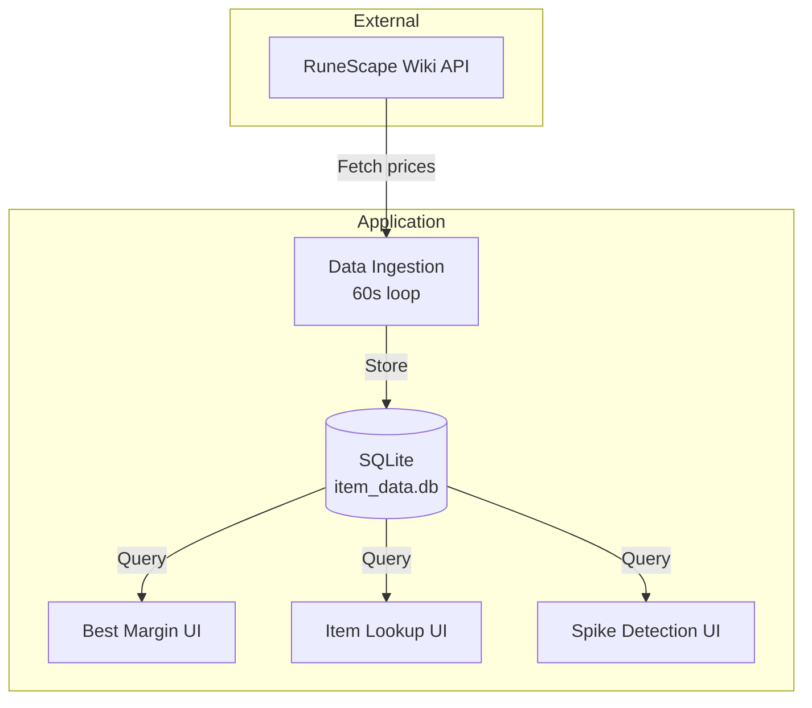

# OSRS Grand Exchange Tracker - Documentation Index

## How to Use This Documentation

**For AI Assistants:** This index serves as your primary entry point to understanding the OSRS GE codebase. Each section below contains metadata about what information is available and where to find it. Use this index to quickly identify which documentation files contain the information you need to answer questions or assist with development tasks.

**For Developers:** This documentation provides a comprehensive overview of the system architecture, components, data models, and workflows. Start with the codebase_info.md for a high-level overview, then dive into specific areas as needed.

---

## Quick Reference

| Question Type | Consult These Files |
|--------------|-------------------|
| "What does this project do?" | codebase_info.md, architecture.md |
| "How do I get started?" | codebase_info.md, dependencies.md |
| "How does the system work?" | architecture.md, workflows.md |
| "What are the main components?" | components.md |
| "How do I interact with the API?" | interfaces.md |
| "What data structures are used?" | data_models.md |
| "What are the dependencies?" | dependencies.md |
| "What needs improvement?" | review_notes.md |

---

## Document Summaries

### 1. codebase_info.md
**Purpose:** High-level project overview and statistics

**Contains:**
- Project description and goals
- Repository structure overview
- Technology stack summary
- Key features list
- Development environment setup
- Basic statistics (LOC, file counts)

**Use This When:**
- Getting initial context about the project
- Understanding the overall purpose
- Learning about the tech stack
- Identifying key directories and their roles

**Key Metadata:**
- Language: Python 3.13+
- Total LOC: ~412
- Main packages: api, usage
- Database: SQLite

---

### 2. architecture.md
**Purpose:** System design, patterns, and architectural decisions

**Contains:**
- Layered architecture overview (5 layers)
- Architecture diagrams (Mermaid)
- Data flow diagrams
- Design patterns used
- Scalability considerations
- Security considerations

**Use This When:**
- Understanding how components interact
- Learning data flow through the system
- Identifying architectural patterns
- Planning system modifications
- Evaluating scalability options

**Key Concepts:**
- Data Collection Layer → Storage Layer → Presentation Layer
- Continuous polling architecture (60-second intervals)
- Merge/upsert strategy for database updates
- Streamlit-based presentation

---

### 3. components.md
**Purpose:** Detailed breakdown of all system components

**Contains:**
- Component responsibilities and relationships
- Key functions and their signatures
- Configuration constants
- Component dependency graph
- Testing structure
- Known issues

**Use This When:**
- Understanding what each module does
- Finding specific functions or classes
- Learning component interactions
- Debugging specific functionality
- Planning refactoring

**Major Components:**
- `item_data.py` - Data ingestion orchestrator
- Data models (Pydantic + SQLModel)
- Utility functions (margin calculation)
- Web applications (best_margin, item_lookup, spike detection)

---

### 4. interfaces.md
**Purpose:** External and internal API specifications

**Contains:**
- RuneScape Wiki API endpoint documentation
- Database interface (SQLModel operations)
- Utility function interfaces
- Streamlit application interfaces
- Data flow between interfaces
- Configuration interfaces
- Error handling approaches

**Use This When:**
- Integrating with external APIs
- Querying the database
- Understanding data transformation
- Troubleshooting API interactions
- Planning interface modifications

**Key Interfaces:**
- 4 RuneScape Wiki API endpoints
- SQLModel database operations (CRUD)
- Margin calculator utility
- Streamlit UI interactions

---

### 5. data_models.md
**Purpose:** Complete data structure documentation

**Contains:**
- Pydantic model definitions (API responses)
- SQLModel table schemas (database)
- Data transformation flows
- Type safety and validation
- Database schema diagram
- Relationship mappings

**Use This When:**
- Understanding data structures
- Working with API responses
- Querying the database
- Planning schema changes
- Debugging data issues

**Models:**
- **Pydantic:** MappingData, LatestData, Volume24h, Volume5m
- **SQLModel:** Item, ItemSnapshot
- Relationships: Item 1-to-many ItemSnapshot

---

### 6. workflows.md
**Purpose:** End-to-end process documentation

**Contains:**
- Data ingestion workflow (main loop)
- User interaction workflows
- Database maintenance procedures
- Development workflows
- Operational procedures
- Monitoring queries

**Use This When:**
- Understanding how processes work end-to-end
- Learning system operation
- Debugging workflow issues
- Planning workflow improvements
- Operating the system

**Key Workflows:**
1. Data Ingestion (continuous, 60s intervals)
2. Best Margin Discovery (user-driven)
3. Item Lookup (user-driven)
4. Spike Detection (planned, incomplete)

---

### 7. dependencies.md
**Purpose:** Complete dependency catalog and management

**Contains:**
- Production dependency details and usage
- Development tool documentation
- Build system configuration
- External service dependencies
- Version constraints and rationale
- Dependency installation methods
- Future considerations

**Use This When:**
- Understanding why dependencies exist
- Troubleshooting dependency issues
- Planning dependency updates
- Adding new dependencies
- Setting up development environment

**Key Dependencies:**
- pydantic 2.11.7+ (validation)
- requests 2.32.4+ (HTTP)
- sqlmodel 0.0.24+ (ORM)
- streamlit 1.48.1+ (UI)
- Python 3.13+

---

### 8. review_notes.md
**Purpose:** Quality assessment and improvement recommendations

**Contains:**
- Consistency check results
- Completeness analysis
- Identified gaps and issues
- Improvement recommendations
- Priority areas for development

**Use This When:**
- Planning improvements
- Understanding limitations
- Identifying technical debt
- Prioritizing work
- Contributing to the project

---

## System Architecture Quick View



---

## Key File Locations

### Source Code
```
api/
├── db/
│   └── item_data.py        # Main data ingestion (147 lines)
├── models/
│   ├── data_models.py       # Pydantic models (67 lines)
│   ├── item_model.py        # Item table (32 lines)
│   └── item_volume_5m.py    # Snapshot table (15 lines)
└── util/
    └── margin.py            # Margin calculator (20 lines)

usage/
├── best_margin.py           # Profit finder UI (83 lines)
├── item_lookup.py           # Item search UI (35 lines)
├── sell_spike.py            # Spike detection (19 lines, incomplete)
└── buy_spike.py             # Spike detection (2 lines, stub)
```

### Configuration
```
pyproject.toml               # Python project config
default.nix                  # Nix development environment
.envrc                       # Direnv configuration
.gitignore                   # Git ignore patterns
```

### Documentation
```
.sop/summary/
├── index.md                 # This file
├── codebase_info.md         # Project overview
├── architecture.md          # System design
├── components.md            # Component details
├── interfaces.md            # API specifications
├── data_models.md           # Data structures
├── workflows.md             # Process documentation
├── dependencies.md          # Dependency catalog
└── review_notes.md          # Quality assessment
```

---

## Common Development Tasks

### Adding a New Streamlit Application
1. **Review:** components.md (existing apps), interfaces.md (database queries)
2. **Create:** New file in `usage/` directory
3. **Reference:** `best_margin.py` as template
4. **Connect:** Use database engine pattern from existing apps

### Modifying Data Models
1. **Review:** data_models.md (current schema)
2. **Update:** Pydantic or SQLModel definition
3. **Consider:** Migration strategy (see dependencies.md for alembic)
4. **Test:** Ensure API→DB transformation still works

### Implementing Spike Detection
1. **Review:** workflows.md (planned workflow), data_models.md (ItemSnapshot)
2. **Query:** ItemSnapshot table for time-series data
3. **Analyze:** Calculate moving averages, detect anomalies
4. **Display:** Use Streamlit charts for visualization

### Adding New API Endpoints
1. **Review:** interfaces.md (existing API patterns)
2. **Define:** Pydantic model for response
3. **Create:** Wrapper function in item_data.py
4. **Integrate:** Into fetch_all_data() flow

### Optimizing Performance
1. **Review:** architecture.md (scalability considerations)
2. **Consider:** Database indexing (data_models.md)
3. **Evaluate:** Async HTTP requests (dependencies.md)
4. **Profile:** Identify bottlenecks

---

## Frequently Asked Questions

### How often is data updated?
**Answer in:** workflows.md, components.md (item_data.py)
- Price data: Every 60 seconds
- Volume snapshots: Every 5 minutes (every 5th run)

### What is the GE tax calculation?
**Answer in:** components.md (util/margin.py), data_models.md (Item.margin)
- 1% of sell price, capped at 5,000,000 coins
- Formula: `profit = (high - min(high / 100, 5M)) - low`

### How do I query the database?
**Answer in:** interfaces.md (Database Interface)
- Use SQLModel: `session.exec(select(Item)).all()`
- Examples provided for common queries

### Why Python 3.13?
**Answer in:** dependencies.md (Runtime Environment)
- Modern type hints (`int | None`)
- Performance improvements
- Latest features

### Are there tests?
**Answer in:** components.md (Testing Structure)
- Test structure exists (test/ directory)
- Source files not in repository (only .pyc bytecode)
- Test coverage unknown

### Can this scale to multiple users?
**Answer in:** architecture.md (Scalability Considerations)
- Current: Single-user (SQLite)
- Future: PostgreSQL, Redis caching, async HTTP

---

## Related Resources

### External Documentation
- [RuneScape Wiki API Docs](https://oldschool.runescape.wiki/w/RuneScape:Real-time_Prices)
- [SQLModel Documentation](https://sqlmodel.tiangolo.com/)
- [Pydantic Documentation](https://docs.pydantic.dev/)
- [Streamlit Documentation](https://docs.streamlit.io/)

### Project Files
- `pyproject.toml` - Complete dependency list
- `default.nix` - Nix environment definition
- `README.md` - Project README (consolidated)

---

## Contributing Guidelines

### Before Making Changes
1. Read codebase_info.md for project overview
2. Review architecture.md to understand design
3. Check review_notes.md for known issues
4. Consult relevant component docs

### Code Quality
- Use `black` for formatting (dependencies.md)
- Run `ruff` for linting
- Check types with `ty`
- Follow existing patterns (components.md)

### Documentation Updates
- Update relevant .md files when changing architecture
- Keep data_models.md in sync with schema changes
- Add new workflows to workflows.md
- Update review_notes.md with new issues/resolutions

---

## Version Information

**Documentation Generated:** 2026-01-19
**Codebase Version:** 0.1.0
**Python Version:** 3.13+
**Documentation Format:** Markdown with Mermaid diagrams

---

## Navigation Tips for AI Assistants

**When you need to:**
- **Understand context:** Start with codebase_info.md → architecture.md
- **Find specific code:** Check components.md
- **Work with data:** Review data_models.md → interfaces.md
- **Understand processes:** Read workflows.md
- **Debug issues:** Check review_notes.md → relevant component docs
- **Add features:** Review architecture.md → components.md → interfaces.md

**Diagram locations:**
- Architecture diagrams: architecture.md
- Component relationships: components.md
- Data flow: interfaces.md, workflows.md
- Database schema: data_models.md

**Best practice:** Skim the index first, then dive deep into 1-2 relevant documents rather than reading everything.
