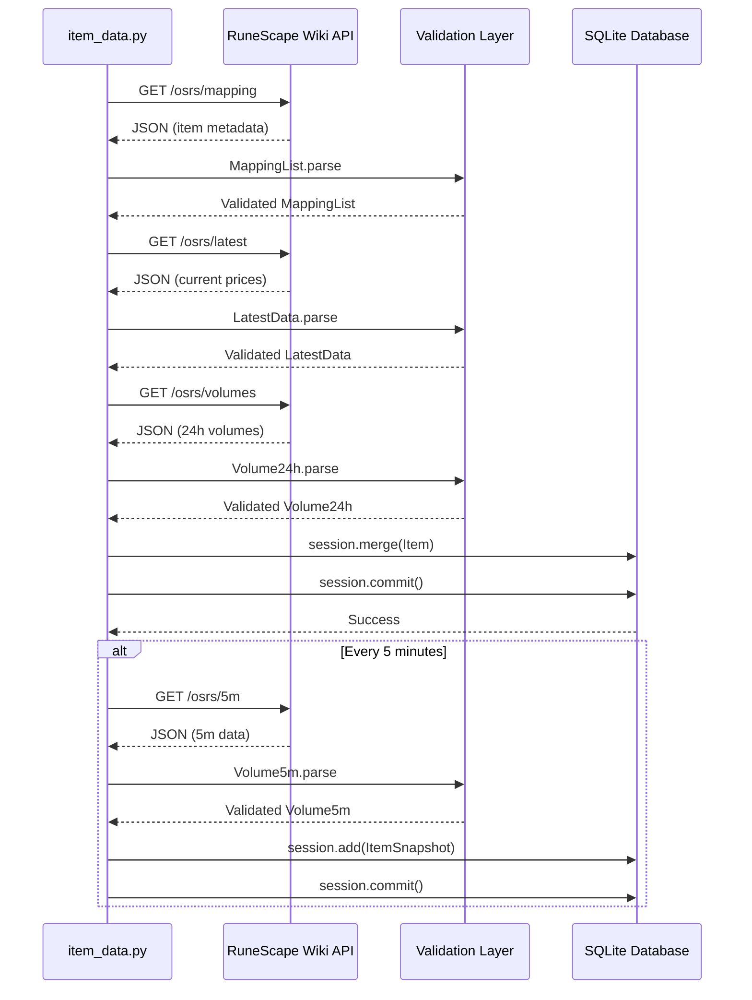
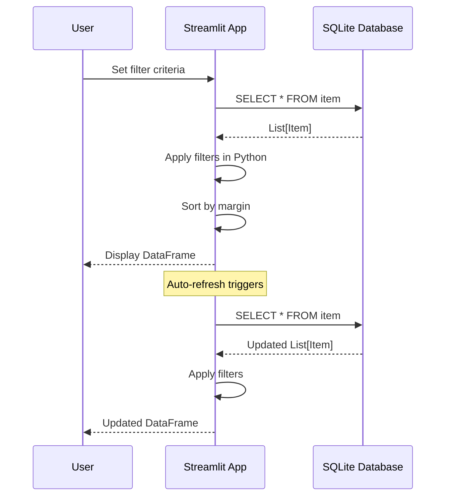

# Interfaces and Integration Points

## External API Interfaces

### RuneScape Wiki API
**Base URL:** `https://prices.runescape.wiki/api/v1/osrs/`

**Authentication:** None required
**Headers Required:**
```python
{
    "User-Agent": "@PapaBear#2007",
    "From": "dev@jade.rip"
}
```

### API Endpoints

#### 1. Mapping Endpoint
**URL:** `/osrs/mapping`
**Method:** GET
**Purpose:** Fetch complete item catalog with metadata

**Response Structure:**
```json
[
  {
    "id": 2,
    "name": "Cannonball",
    "examine": "Ammo for the Dwarf Cannon.",
    "members": true,
    "lowalch": 2,
    "highalch": 3,
    "limit": 11000,
    "value": 5,
    "icon": "https://..."
  },
  ...
]
```

**Response Model:** `MappingList`
**Update Frequency:** Once per run (static metadata)

---

#### 2. Latest Prices Endpoint
**URL:** `/osrs/latest`
**Method:** GET
**Purpose:** Get current instant-buy and instant-sell prices

**Response Structure:**
```json
{
  "data": {
    "2": {
      "high": 185,
      "highTime": 1737318429,
      "low": 184,
      "lowTime": 1737318426
    },
    ...
  }
}
```

**Field Descriptions:**
- `high` - Instant-sell price (what you receive when selling)
- `highTime` - Unix timestamp of last high price update
- `low` - Instant-buy price (what you pay when buying)
- `lowTime` - Unix timestamp of last low price update

**Response Model:** `LatestData`
**Update Frequency:** Every 60 seconds

---

#### 3. 24-Hour Volume Endpoint
**URL:** `/osrs/volumes`
**Method:** GET
**Purpose:** Get total 24-hour trading volume per item

**Response Structure:**
```json
{
  "timestamp": 1737318000,
  "data": {
    "2": 15432189,
    "3": 0,
    ...
  }
}
```

**Field Descriptions:**
- `timestamp` - Unix timestamp of data
- `data` - Dictionary mapping item ID (as string) to volume count

**Response Model:** `Volume24h`
**Update Frequency:** Every 60 seconds

---

#### 4. 5-Minute Volume Endpoint
**URL:** `/osrs/5m`
**Method:** GET
**Purpose:** Get recent 5-minute interval price and volume data

**Response Structure:**
```json
{
  "timestamp": 1737318300,
  "data": {
    "2": {
      "avgHighPrice": 185,
      "highPriceVolume": 52341,
      "avgLowPrice": 184,
      "lowPriceVolume": 48921
    },
    ...
  }
}
```

**Field Descriptions:**
- `avgHighPrice` - Average instant-sell price in interval
- `highPriceVolume` - Number of items sold in interval
- `avgLowPrice` - Average instant-buy price in interval
- `lowPriceVolume` - Number of items bought in interval

**Response Model:** `Volume5m`
**Update Frequency:** Every 5 minutes (every 5th run of main loop)
**Storage:** Saved to ItemSnapshot table for historical analysis

---

## Internal Interfaces

### Database Interface (SQLModel)

#### Connection
```python
engine = create_engine("sqlite:///item_data.db")
session = Session(engine)
SQLModel.metadata.create_all(engine)
```

#### Item Table Operations

**Create/Update Item:**
```python
item = Item(
    id=item_id,
    name="Item Name",
    high=185,
    low=184,
    volume_24h=1000000
)
session.merge(item)  # Upsert operation
session.commit()
```

**Query Items:**
```python
# Get all items
all_items = session.exec(select(Item)).all()

# Get specific item by name
statement = select(Item).where(Item.name == "Cannonball")
item = session.exec(statement).first()

# Get item by ID
item = session.get(Item, item_id)
```

**Filter Items:**
```python
# Items with high margin
statement = select(Item).where(Item.margin > 10000)
profitable = session.exec(statement).all()
```

#### ItemSnapshot Table Operations

**Create Snapshot:**
```python
snapshot = ItemSnapshot(
    item_id=2,
    timestamp=datetime.now(timezone.utc),
    avg_high_price=185.5,
    high_price_volume=52341,
    avg_low_price=184.2,
    low_price_volume=48921,
    total_volume=101262
)
session.add(snapshot)
session.commit()
```

**Query Snapshots:**
```python
# Get all snapshots for an item
statement = select(ItemSnapshot).where(ItemSnapshot.item_id == 2)
snapshots = session.exec(statement).all()

# Get recent snapshots
from datetime import timedelta
recent_time = datetime.now(timezone.utc) - timedelta(hours=1)
statement = select(ItemSnapshot).where(ItemSnapshot.timestamp > recent_time)
recent = session.exec(statement).all()
```

---

### Utility Interfaces

#### Margin Calculator
```python
from backend.util.margin import ge_margin

# Calculate profit after GE tax
profit = ge_margin(high_price=185, low_price=184)
# Returns: 182 (185 - 1% tax - 184)

# High-value item example
profit = ge_margin(high_price=1_000_000_000, low_price=900_000_000)
# Returns: 94_990_000 (1B - 5M tax cap - 900M)
```

---

### Streamlit Application Interfaces

#### Best Margin App
**Entry Point:** `streamlit run usage/best_margin.py`

**User Interactions:**
- Filter by low price: operator + value
- Filter by high price: operator + value
- Filter by margin: operator + value
- Filter by volume: operator + value
- View filtered results in sortable table
- Auto-refresh every 60 seconds

#### Item Lookup App
**Entry Point:** `streamlit run usage/item_lookup.py`

**User Interactions:**
- Enter search text for fuzzy matching
- Select item from filtered dropdown
- View complete item details

**Known Issue:** References non-existent `item_name` property

---

## Data Flow Interfaces

### API → Database Flow


### Database → UI Flow


---

## Configuration Interfaces

### Environment Configuration
No environment variables currently used. Configuration is hardcoded in modules:

**Database Location:**
```python
# backend/db/item_data.py
DB_FILE = "sqlite:///item_data.db"

# usage/*.py
engine = create_engine("sqlite:///item_data.db")
```

**Potential Improvement:** Use environment variables for configuration
```python
import os
DB_FILE = os.getenv("DATABASE_URL", "sqlite:///item_data.db")
```

### API Configuration
```python
# backend/db/item_data.py
LATEST_API_URL = "https://prices.runescape.wiki/api/v1/osrs/latest"
MAPPING_API_URL = "https://prices.runescape.wiki/api/v1/osrs/mapping"
VOLUME_API_URL = "https://prices.runescape.wiki/api/v1/osrs/volumes"
VOLUME_5M_API_URL = "https://prices.runescape.wiki/api/v1/osrs/5m"

HEADERS = {
    "User-Agent": "@PapaBear#2007",
    "From": "dev@jade.rip",
}
```

---

## Error Handling

### API Errors
```python
def fetch_data(api_url) -> dict:
    response = requests.get(api_url, headers=HEADERS)
    if response.status_code == 200:
        return response.json()
    else:
        raise Exception(f"Failed to fetch data: {response.status_code}")
```

**Current Behavior:**
- Raises exception on non-200 status
- No retry logic
- No timeout handling
- Main loop will crash on API failure

**Potential Improvements:**
- Implement retry with exponential backoff
- Add timeout to requests
- Log errors instead of crashing
- Continue with stale data on API failure

### Database Errors
- SQLModel handles connection errors
- No explicit error handling in update operations
- Transaction commits may fail silently

### UI Errors
- Streamlit catches most exceptions and displays error messages
- No specific error handling in usage apps
