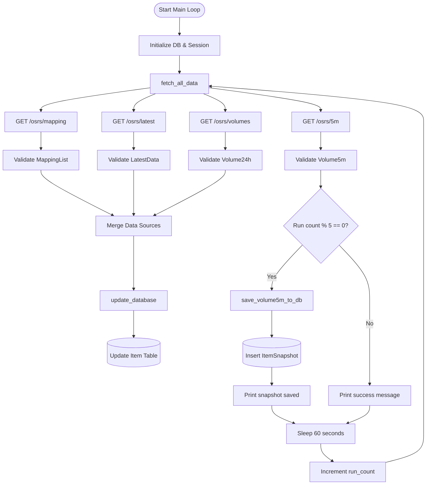
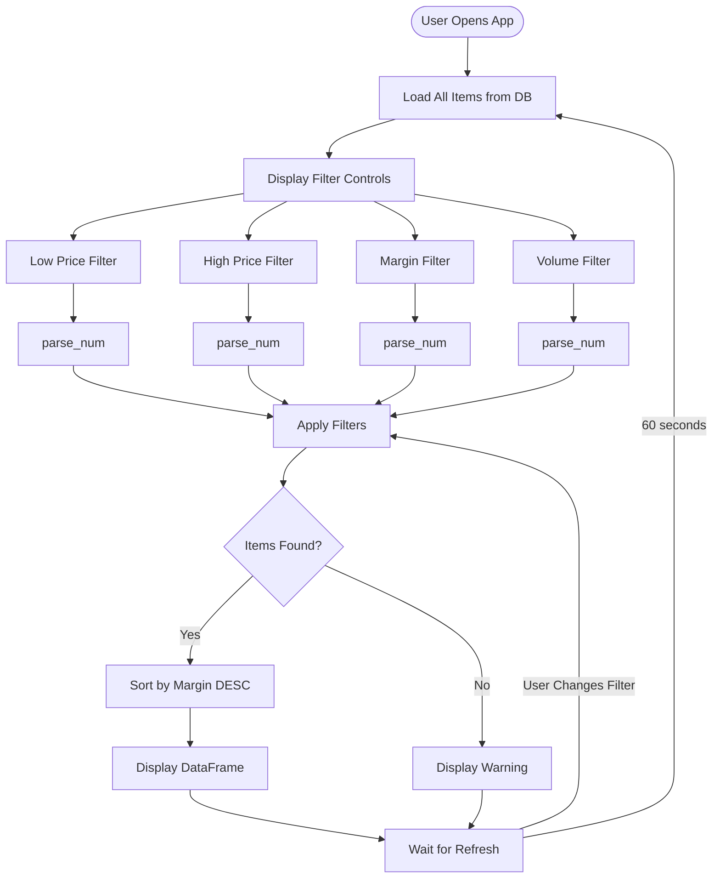
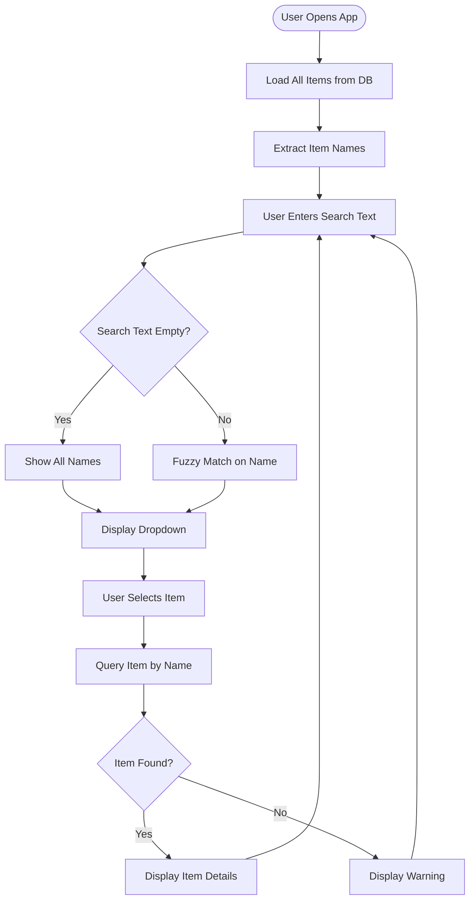
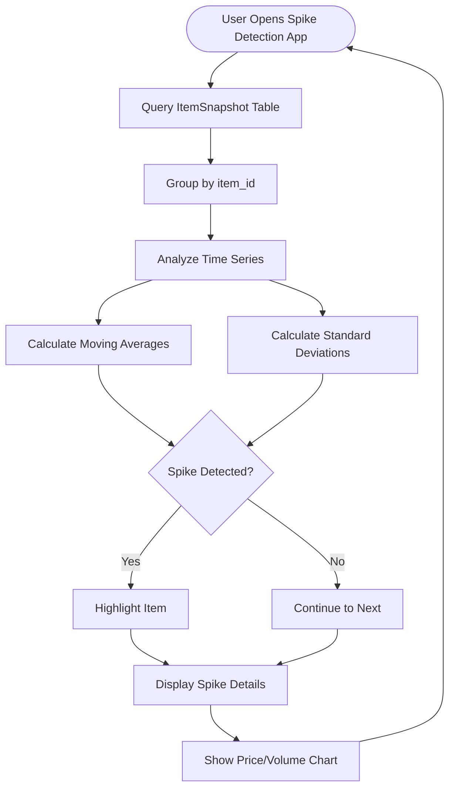
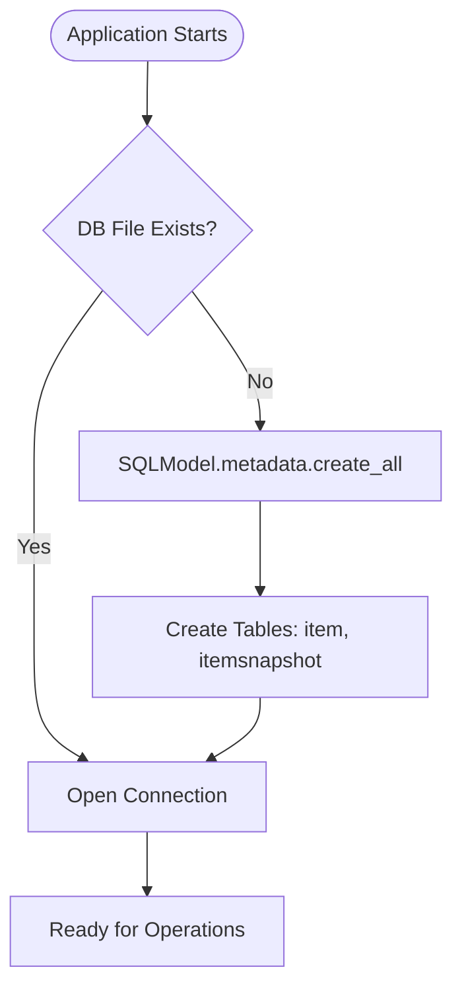
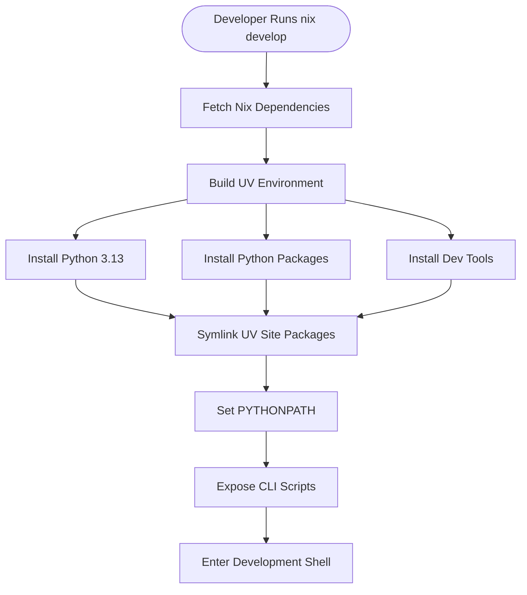
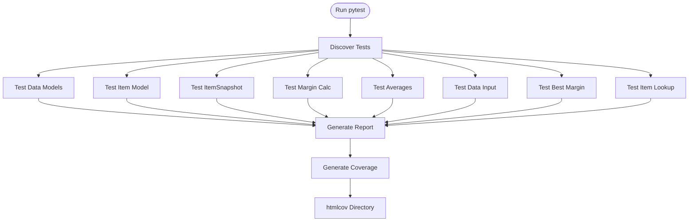

# Workflows and Processes

## Primary Workflows

### 1. Data Ingestion Workflow

**Purpose:** Continuously fetch and update market data from RuneScape Wiki API

**Frequency:** Every 60 seconds (5-minute intervals for snapshots)

**Entry Point:** `python -m backend.db.item_data`



**Detailed Steps:**

**Step 1: Initialization**
```python
engine = create_engine(DB_FILE)
session = Session(engine)
SQLModel.metadata.create_all(engine)
run_count = 0
```

**Step 2: Fetch All Data**
```python
mapping_data, latest_data, volume_data, volume_5m_data = fetch_all_data()
```

**Step 3: Update Item Table**
```python
mapping_dict = {item.id: item for item in mapping_data.items}
volume_dict = volume_data.data

for item_id, prices in latest_data.data.items():
    mapping_info = mapping_dict.get(item_id)
    if not mapping_info:
        continue

    volume_info = volume_dict.get(str(item_id), 0)

    item = Item(
        id=item_id,
        name=mapping_info.name,
        # ... all other fields
    )
    session.merge(item)  # Upsert

session.commit()
```

**Step 4: Save Volume Snapshots (Every 5th Run)**
```python
if run_count % 5 == 0:
    save_volume5m_to_db(volume_5m_data, engine)
    print("ItemVolume5m table updated!")
```

**Step 5: Wait and Repeat**
```python
print("Data saved successfully!")
print("Waiting 60 seconds for next run...")
run_count += 1
time.sleep(60)
```

**Error Handling:**
- API failures raise exceptions (crashes loop)
- No retry logic
- No graceful degradation

**Monitoring:**
- Console output for each successful run
- Special message for snapshot saves
- No logging framework

---

### 2. Best Margin Discovery Workflow

**Purpose:** Help users find profitable trading opportunities

**Entry Point:** `streamlit run usage/best_margin.py`

**User Interface Flow:**



**Detailed Steps:**

**Step 1: Initialize and Query Database**
```python
engine = create_engine("sqlite:///item_data.db")
with Session(engine) as session:
    all_items = session.exec(select(Item)).all()
```

**Step 2: Accept User Input**
```python
low_price_op = st.selectbox("Low price operator", ["<", ">"])
low_price_val = st.text_input("Low price value", value="100b")
high_price_op = st.selectbox("High price operator", ["<", ">"])
high_price_val = st.text_input("High price value", value="100b")
margin_op = st.selectbox("Margin operator", [">", "<"])
margin_val = st.text_input("Margin value", value="100k")
volume_op = st.selectbox("Volume operator", [">", "<"])
volume_val = st.text_input("Volume value", value="0")
```

**Step 3: Parse Human-Readable Numbers**
```python
def parse_num(val):
    # Handles: 100k, 1.5m, 2b, etc.
    if val.endswith("k"): return int(float(val[:-1]) * 1_000)
    if val.endswith("m"): return int(float(val[:-1]) * 1_000_000)
    if val.endswith("b"): return int(float(val[:-1]) * 1_000_000_000)
    if val.endswith("t"): return int(float(val[:-1]) * 1_000_000_000_000)
    return int(val)
```

**Step 4: Filter Items**
```python
filtered_items = [
    item for item in all_items
    if compare(item.low, low_price_op, parse_num(low_price_val))
    and compare(item.high, high_price_op, parse_num(high_price_val))
    and compare(item.margin, margin_op, parse_num(margin_val))
    and compare(item.volume_24h, volume_op, parse_num(volume_val))
]
```

**Step 5: Display Results**
```python
if filtered_items:
    df = pd.DataFrame([{
        "Name": item.name,
        "Low": item.low,
        "High": item.high,
        "Margin": item.margin,
        "Volume": item.volume_24h,
    } for item in filtered_items])
    df = df.sort_values(by="Margin", ascending=False)
    st.dataframe(df)
else:
    st.warning("No items found matching criteria.")
```

**Auto-Refresh:**
```python
st_autorefresh(interval=REFRESH_INTERVAL * 1000, key="db_refresh")
```

---

### 3. Item Lookup Workflow

**Purpose:** Search for specific items and view their details

**Entry Point:** `streamlit run usage/item_lookup.py`



**Detailed Steps:**

**Step 1: Query All Items**
```python
all_items = session.exec(select(Item)).all()
item_names = [item.item_name for item in all_items]  # BUG: should be .name
```

**Step 2: Filter by Search Text**
```python
search_text = st.text_input("Fuzzy search item name:")

if search_text:
    filtered_names = [
        name for name in item_names
        if search_text.lower() in name.lower()
    ]
else:
    filtered_names = item_names
```

**Step 3: Select and Display**
```python
selected_name = st.selectbox("Select item:", filtered_names)

if selected_name:
    statement = select(Item).where(Item.name == selected_name)
    item = session.exec(statement).first()
    if item:
        st.write(item)
    else:
        st.warning("Item not found.")
```

**Known Issues:**
- References `item.item_name` instead of `item.name`
- No error handling for database query failures

---

### 4. Spike Detection Workflow (Planned)

**Purpose:** Identify abnormal price or volume changes for trading opportunities

**Status:** In development (incomplete implementation)

**Intended Flow:**



**Planned Features:**
- Detect buy spikes (sudden increase in buy price/volume)
- Detect sell spikes (sudden increase in sell price/volume)
- Configurable sensitivity thresholds
- Historical chart visualization
- Alert system for significant opportunities

**Current Implementation Status:**
- `buy_spike.py` - Only a comment
- `sell_spike.py` - Basic database queries, no analysis logic

---

## Supporting Workflows

### Database Initialization

**When:** First run or after database deletion

**Process:**


**Code:**
```python
engine = create_engine("sqlite:///item_data.db")
SQLModel.metadata.create_all(engine)
```

---

### Nix Development Environment Setup

**Entry Point:** `nix develop` or `direnv allow`

**Process:**


**Available Scripts:**
- `black` - Code formatter
- `ruff` - Linter
- `ty` - Type checker
- `db` - Run data ingestion

---

### Testing Workflow (Historical)

**Note:** Test source files not in repository

**Inferred Structure:**


**Test Categories:**
- **Unit Tests:** Models, utilities
- **Integration Tests:** Database operations
- **UI Tests:** Streamlit applications

---

## Operational Procedures

### Starting the System

**Step 1: Start Data Collection**
```bash
# Terminal 1
python -m backend.db.item_data
# Or with Nix:
db
```

**Step 2: Launch Web Interface**
```bash
# Terminal 2
streamlit run usage/best_margin.py

# Or other apps:
streamlit run usage/item_lookup.py
```

### Stopping the System

**Data Collection:**
- Press `Ctrl+C` to stop the infinite loop
- Partial data updates are committed

**Web Interface:**
- Press `Ctrl+C` in terminal
- Streamlit handles graceful shutdown

### Database Maintenance

**Backup:**
```bash
cp item_data.db item_data.db.backup
```

**Reset:**
```bash
rm item_data.db
# Next run will recreate with fresh data
```

**Inspect:**
```bash
sqlite3 item_data.db
.tables
.schema item
SELECT COUNT(*) FROM item;
```

### Monitoring

**Check Data Freshness:**
```sql
SELECT name, datetime(highTime, 'unixepoch') as last_update
FROM item
ORDER BY highTime DESC
LIMIT 10;
```

**Check Snapshot Collection:**
```sql
SELECT COUNT(*) as snapshot_count,
       MIN(timestamp) as oldest,
       MAX(timestamp) as newest
FROM itemsnapshot;
```

**Find Profitable Items:**
```sql
SELECT name, low, high,
       (high - MAX(high / 100, 5000000) - low) as margin,
       volume_24h
FROM item
WHERE margin > 10000
  AND volume_24h > 1000
ORDER BY margin DESC
LIMIT 20;
```
