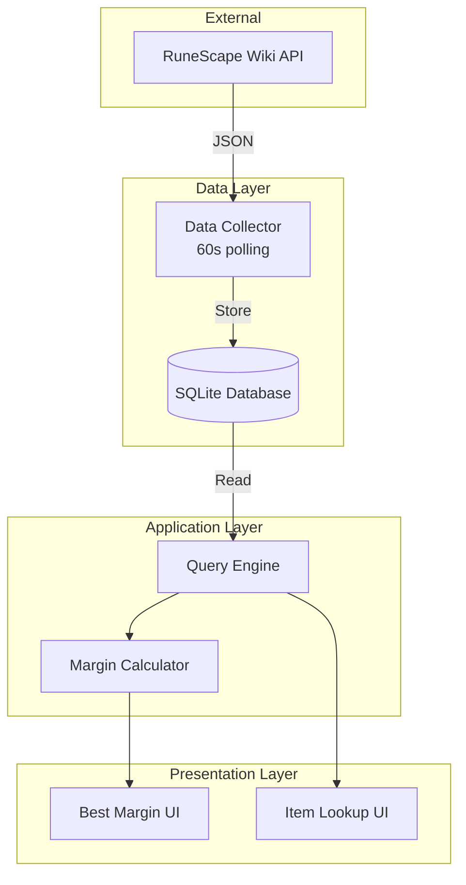

# OSRS Grand Exchange Tracker

A real-time Old School RuneScape (OSRS) Grand Exchange price tracking and margin analysis tool. Track live market data, discover profitable trading opportunities, and analyze volume trends—all from your local machine.

[](https://www.python.org/downloads/)
[](LICENSE)

## 🎯 Features

- **Real-Time Price Tracking** - Fetches live market data every 60 seconds from RuneScape Wiki API
- **Margin Analysis** - Calculate profit margins with accurate GE tax considerations
- **Interactive Dashboards** - User-friendly Streamlit interfaces for data exploration
- **Volume Tracking** - Historical 5-minute interval data for trend analysis
- **Smart Filtering** - Find trading opportunities with customizable criteria
- **Auto-Refresh** - Dashboards update automatically to show latest data

## 📸 Screenshots

### Best Margin Finder
Find the most profitable items to flip with customizable filters for price, margin, and volume.

### Item Lookup
Search for specific items with fuzzy matching and view complete market details.

## 🚀 Quick Start

### Prerequisites

- Python 3.13 or higher
- [uv](https://github.com/astral-sh/uv) (recommended) or pip

### Installation

1. **Clone the repository**
   ```bash
   git clone https://github.com/yourusername/osrs_ge.git
   cd osrs_ge
   ```

2. **Install dependencies**

   Using uv (recommended):
   ```bash
   uv sync
   ```

   Or using pip:
   ```bash
   pip install -e .
   ```

3. **Start data collection**
   ```bash
   python -m backend.db.item_data
   ```

   This will start fetching market data every 60 seconds. Leave this running in the background.

4. **Launch the web interface** (in a new terminal)
   ```bash
   streamlit run usage/best_margin.py
   ```

5. **Open your browser** to `http://localhost:8501` and start analyzing!

## 📖 Usage

### Data Collection

The data collection service continuously fetches market data from the RuneScape Wiki API:

```bash
python -m backend.db.item_data
```

**What it does:**
- Fetches current prices every 60 seconds
- Updates item metadata and volumes
- Stores historical snapshots every 5 minutes
- Saves everything to a local SQLite database (`item_data.db`)

**Console output:**
```
Data saved successfully!
Waiting 60 seconds for next run...
ItemVolume5m table updated!
```

### Web Dashboards

#### Best Margin Finder
Find profitable trading opportunities:

```bash
streamlit run usage/best_margin.py
```

**Features:**
- Filter by buy price, sell price, margin, and volume
- Support for human-readable numbers (e.g., "100k", "1.5m", "2b")
- Real-time sorting by profit margin
- Auto-refresh every 60 seconds

**Example filters:**
- Margin > 10k
- Volume > 1000
- Low price < 1m
- High price < 100m

#### Item Lookup
Search for specific items:

```bash
streamlit run usage/item_lookup.py
```

**Features:**
- Fuzzy search by item name
- Case-insensitive substring matching
- Complete item details including prices, volume, and metadata

### Understanding the Data

**Price Fields:**
- **Low Price** - Instant buy price (what you pay)
- **High Price** - Instant sell price (what you receive)
- **Margin** - Your profit after GE tax: `(high_price - tax) - low_price`
- **Volume** - Total items traded in last 24 hours

**GE Tax Calculation:**
- 1% of sell price
- Capped at 5,000,000 coins
- Formula: `tax = min(high_price / 100, 5_000_000)`

## 🏗️ Architecture

The application follows a clean layered architecture:



### Tech Stack

- **Language:** Python 3.13+
- **Database:** SQLite with SQLModel ORM
- **Web Framework:** Streamlit
- **Data Validation:** Pydantic
- **HTTP Client:** requests
- **Dev Tools:** black, ruff, ty

### Project Structure

```
osrs_ge/
├── backend/              # Core data collection and models
│   ├── db/                 # Database operations
│   │   └── item_data.py   # Main data ingestion script
│   ├── models/             # Data models (Pydantic + SQLModel)
│   │   ├── data_models.py  # API response models
│   │   ├── item_model.py   # Item database table
│   │   └── item_volume_5m.py  # Snapshot table
│   └── util/               # Utility functions
│       └── margin.py       # Margin calculator
├── usage/                  # Streamlit web applications
│   ├── best_margin.py      # Profit finder dashboard
│   ├── item_lookup.py      # Item search interface
│   ├── sell_spike.py       # Spike detection (WIP)
│   └── buy_spike.py        # Spike detection (WIP)
├── tests/                  # Test suite
├── .sop/summary/           # Detailed documentation
└── pyproject.toml          # Project configuration
```

## 🔧 Development

### Development Environment

The project uses Nix for reproducible development environments:

```bash
# Enter development shell
nix develop

# Or use direnv
direnv allow
```

### Development Tools

**Formatting:**
```bash
black backend/ usage/
```

**Linting:**
```bash
ruff check backend/ usage/
ruff format backend/ usage/
```

**Type Checking:**
```bash
ty check backend/ usage/
```

### Running Tests

```bash
pytest
```

### Database Management

**View database contents:**
```bash
sqlite3 item_data.db
.tables
.schema item
SELECT * FROM item LIMIT 10;
```

**Backup database:**
```bash
cp item_data.db item_data.db.backup
```

**Reset database:**
```bash
rm item_data.db
# Next run will recreate with fresh data
```

## 📊 Data Sources

This application uses the [RuneScape Wiki Real-Time Prices API](https://oldschool.runescape.wiki/w/RuneScape:Real-time_Prices), a community-maintained service providing live market data.

**API Endpoints:**
- `/osrs/mapping` - Item metadata
- `/osrs/latest` - Current prices
- `/osrs/volumes` - 24-hour volumes
- `/osrs/5m` - 5-minute interval data

**Rate Limits:** No explicit limits, but respectful usage is encouraged (hence 60-second intervals).

## 🐛 Known Issues

1. **Item Lookup Bug:** References non-existent property `item_name` (should be `name`)
2. **Incomplete Features:** Spike detection apps are work in progress
3. **No Error Recovery:** Application crashes on API failures (no retry logic)

See [review_notes.md](.sop/summary/review_notes.md) for complete list of known issues and planned improvements.

## 📚 Documentation

Comprehensive documentation is available in the `.sop/summary/` directory:

- **[codebase_info.md](.sop/summary/codebase_info.md)** - Project overview and statistics
- **[architecture.md](.sop/summary/architecture.md)** - System design and patterns
- **[components.md](.sop/summary/components.md)** - Component details
- **[interfaces.md](.sop/summary/interfaces.md)** - API specifications
- **[data_models.md](.sop/summary/data_models.md)** - Data structures
- **[workflows.md](.sop/summary/workflows.md)** - Process documentation
- **[dependencies.md](.sop/summary/dependencies.md)** - Dependency catalog
- **[review_notes.md](.sop/summary/review_notes.md)** - Issues and recommendations

**Quick navigation:** Start with [index.md](.sop/summary/index.md) for AI-optimized documentation index.

## 🤝 Contributing

Contributions are welcome! Here's how you can help:

### Priority Areas
1. **Fix critical bugs** (see review_notes.md)
2. **Implement spike detection** algorithms
3. **Add error handling** and retry logic
4. **Optimize database queries** with proper indexing
5. **Improve test coverage**

### Contribution Workflow
1. Fork the repository
2. Create a feature branch (`git checkout -b feature/amazing-feature`)
3. Make your changes
4. Run linters and formatters (`black`, `ruff`, `ty`)
5. Commit your changes (`git commit -m 'Add amazing feature'`)
6. Push to the branch (`git push origin feature/amazing-feature`)
7. Open a Pull Request

### Code Style
- Follow existing patterns (see [components.md](.sop/summary/components.md))
- Use type hints throughout
- Add docstrings for public functions
- Keep line length to 88 characters (black default)
- Run `ruff` before committing

## 🔮 Roadmap

### Version 0.2.0
- [ ] Fix critical bugs (property name, null checks)
- [ ] Add error handling and logging
- [ ] Complete spike detection feature
- [ ] Add database indexes for performance

### Version 0.3.0
- [ ] Implement async HTTP for faster API calls
- [ ] Add caching layer (Redis)
- [ ] Create configuration management system
- [ ] Add monitoring and metrics

### Version 1.0.0
- [ ] Multi-user support (PostgreSQL migration)
- [ ] Alert system for profit opportunities
- [ ] Historical charting and trends
- [ ] Mobile-responsive UI

## 📝 License

This project is licensed under the MIT License - see the [LICENSE](LICENSE) file for details.

## 🙏 Acknowledgments

- [RuneScape Wiki](https://oldschool.runescape.wiki/) for providing the real-time prices API
- The OSRS community for market data contributions
- [SQLModel](https://sqlmodel.tiangolo.com/) for the excellent ORM
- [Streamlit](https://streamlit.io/) for the rapid UI development framework

## 📞 Support

- **Issues:** [GitHub Issues](https://github.com/yourusername/osrs_ge/issues)
- **Discussions:** [GitHub Discussions](https://github.com/yourusername/osrs_ge/discussions)
- **Email:** dev@jade.rip

## ⚠️ Disclaimer

This is a community project and is not affiliated with or endorsed by Jagex Ltd. Old School RuneScape is a trademark of Jagex Ltd.

---

**Made with ❤️ for the OSRS community**

Happy flipping! 💰
